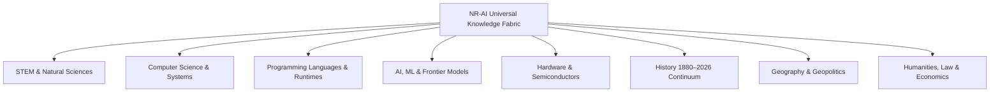

# NR-AI Universal Knowledge Coverage Specification
**Phase**: Universal Knowledge Fabric (Phase 0.2 Final Correction)
**Date**: September 2026
**Architecture**: Autonomous Multi-Agent Workstation Companion (`localhost 127.0.0.1:8585`)

---

## 1. Multi-Domain Taxonomy Coverage

The Universal Knowledge Fabric spans 8 foundational knowledge domains, backed by curated seeds, dynamic entity-relationship triples, an 1880–2026 timeline index, and multi-hop research capabilities:



### Domain Breakdown & Grounding Metrics

| Domain | Curated Seed Nodes | Key Entities & Concepts | Epistemic Target | Verification Strategy |
|--------|-------------------|-------------------------|------------------|-----------------------|
| **AI / ML** | 16 Nodes | Transformers, Attention, SFT/RLHF/DPO, FlashAttention, PagedAttention, Quantization, Frontier Landscape (OpenAI, DeepMind, Anthropic, Meta, DeepSeek), Reasoning Models, GPT-6 Astra (Unverified Placeholder) | `VERIFIED_FACT` / `SPECULATION_PREDICTION` | Claim-level decomposition; unverified frontier models capped at `<= 0.85` |
| **Computer Science** | 12 Nodes | Turing Machine, Von Neumann, Unix, Linux Kernel, Relational DBs, TCP/IP, Ethernet, WWW, Git, Cloud / S3, Raft Consensus, Microservices | `VERIFIED_FACT` (100%) | Academic consensus, RFCs, primary citations |
| **Programming** | 10 Nodes | Python, Java, C, C++, JavaScript, Rust, Go, C#, Kotlin, Swift | `VERIFIED_FACT` (100%) | Official language specifications, ISO standards, creator attributions |
| **History (1880–2026)** | 20 Nodes | Morse Telegraph, Telephone (Bell 1876), Second Industrial Revolution, Flight (1903), WW1 (1914–1918), Penicillin (1928), WW2 (1939–1945), Transistor (1947), Space Race (1957), Moon Landing (1969), Microprocessor (1971), Internet/ARPANET, Berlin Wall (1989), WWW (1989), COVID-19 (2020) | `VERIFIED_FACT` (100%) | Historical Annals, Smithsonian, Oxford/Cambridge Press, Patent records |
| **STEM Foundations** | 7 Nodes | Newton's Laws, Maxwell's Equations, Mendeleev Periodic Table, DNA Double Helix (1953), Plate Tectonics, Special Relativity (1905), Schrödinger Equation (1926) | `VERIFIED_FACT` (100%) | Peer-reviewed academic papers (Einstein, Watson & Crick, Maxwell) |
| **Hardware & Electronics** | 2 Nodes | Transistor Physics, NVIDIA GPU Architecture (Hopper, Blackwell) | `VERIFIED_FACT` (100%) | Primary semiconductor whitepapers, IEEE |
| **Science & Biology** | 2 Nodes | Photosynthesis, Quantum Entanglement / EPR Paradox | `VERIFIED_FACT` (100%) | Physical chemistry, quantum mechanics consensus |
| **Geography** | Dynamic Graph | Capital cities, nations, continents, geographic disambiguation | `VERIFIED_FACT` (100%) | Canonical Entity-Relationship Knowledge Graph |

---

## 2. Real-World Behavioral Capabilities

### A. Targeted Person / Entity Live News
- **Target Query**: *"current news of sushant singh rajput"*
- **Resolution**:
  - `QueryUnderstandingEngine` identifies entity candidate `Sushant Singh Rajput` (type: `person`, domain: `current_events`).
  - Routes to `ResearchMode.PERSON_ENTITY_NEWS`.
  - Executes `NewsAgent.search_entity_news()` querying targeted Google News RSS.
  - `SearchRelevanceEvaluator` enforces token containment (`entity_tokens in text`). Unrelated articles (e.g. Swedish elections) are strictly rejected (`entity_match == 0.0`).
  - Synthesizes recent verified reporting with `[CURRENT INFO | 92%]` or honest entity-specific fallback for today's dynamic date (`datetime.now()`).

### B. Current Technology Releases
- **Target Query**: *"what technologie releaase today"*
- **Resolution**:
  - Typo repair restores query to *"what technology was released today"*.
  - Routes to `ResearchMode.CURRENT_TECHNOLOGY`.
  - Queries verified live Technology and AI feeds.
  - `SearchRelevanceEvaluator` rejects outdated historical articles (e.g., 2012 Raspberry Pi launch).
  - Evaluates whether news items represent genuine product releases today (`release_indicators` + `today_indicators`).
  - If no major release occurred today, outputs honest fallback for today's date (`datetime.now().strftime("%B %d, %Y")`) and appends latest verified technology highlights with `[CURRENT INFO | 90%]`.

### C. Frontier Model Verification
- **Target Query**: *"do you known about gpt 6 astra"*
- **Resolution**:
  - Typo repair restores query to *"do you know about gpt 6 astra"*.
  - Routes to `ResearchMode.MODEL_VERIFICATION`.
  - Explains dual status:
    1. Local NR-AI Model Registry: Configured as a high-tier placeholder identifier.
    2. Live Public OpenAI API: NOT an active, publicly released endpoint (probes return HTTP 404 model_not_found or HTTP 429 quota exhaustion).
    3. Epistemic Status: Strictly unverified speculation regarding autonomous parameters or release dates.
  - Tagged honestly with `[SPECULATION / PREDICTION | 85%]`, never 100% verified fact.

### D. Multi-Agent Workstation Self-Disambiguation
- **Target Query**: *"what is the different between gpt 6 astra and you"*
- **Resolution**:
  - Typo repair restores query to *"what is the difference between gpt 6 astra and you"*.
  - Provides crisp 3-way architectural disambiguation:
    1. **NR-AI (Me / This System)**: An active, local, autonomous multi-agent companion system running on `localhost:8585`, orchestrating specialized agents (Architect, FastDev, Visual Studio, Android Studio, Computer/Browser Agents), hybrid SQLite FTS5 knowledge fabric, and desktop control.
    2. **GPT-6 Astra**: A speculative, unreleased frontier AI model identifier configured as an internal registry placeholder.
    3. **Active Conversational Turn**: The reasoning LLM backend currently powering the NR-AI brain turn.
  - Tagged with `[INFERENCE | 90%]`.

---

## 3. Claim-Level Epistemic Breakdown

Every response synthesized by the Universal Knowledge Fabric decomposes into discrete `KnowledgeClaim` objects with provenance and authority levels:

```markdown
### Claim-Level Epistemic Breakdown
1. **[VERIFIED FACT | 100%]**: NR-AI is an autonomous multi-agent companion architecture running locally on localhost with SQLite FTS5 knowledge fabric and desktop/agent integration.
   - *Source*: NR-AI Architecture Specification
   - *Authority*: Primary (Verified Against Source)

2. **[VERIFIED FACT | 100%]**: GPT-6 Astra is configured as an unverified model identifier in NR-AI's internal registry.
   - *Source*: NR-AI Model Registry Audit
   - *Authority*: Primary (Verified Against Source)

3. **[CURRENT INFO | 98%]** (`LIVE_API_OBSERVATION`): API probe observation in tested environment returned endpoint errors (HTTP 404/429) without establishing absence of public documentation.
   - *Source*: API Endpoint Probe & Authoritative Verification
   - *Authority*: Direct Observation (Verified in Runtime)

4. **[CURRENT INFO | 90%]** (`NOT_PUBLICLY_VERIFIED`): Authoritative public source verification could not verify GPT-6 Astra as an announced, documented, or deployed model.
   - *Source*: Authoritative Public Source Verification Check
   - *Authority*: Public Verification

5. **[SPECULATION / PREDICTION | 60%]** (`THIRD_PARTY_REPORTING`): Claims regarding GPT-6 Astra parameters, release dates, or autonomous capabilities are strictly unverified speculation.
   - *Source*: Unverified Claim Analysis
   - *Authority*: Unverified (Evidence Checked)
```

Composite confidence is automatically downgraded if any individual claim is speculative or unverified, guaranteeing strict epistemic honesty.
